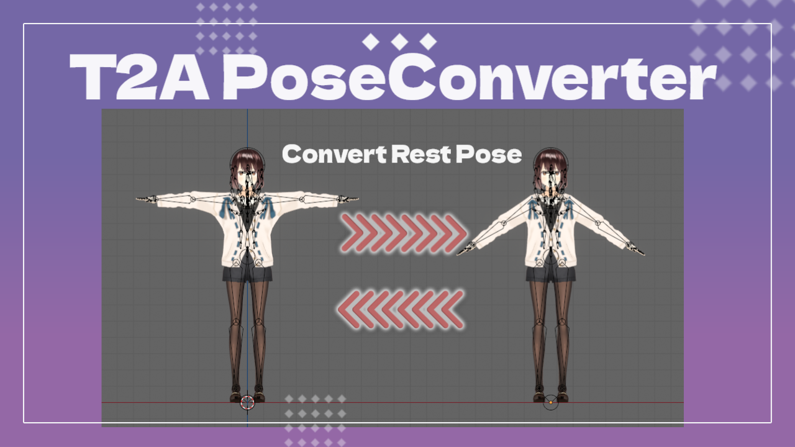
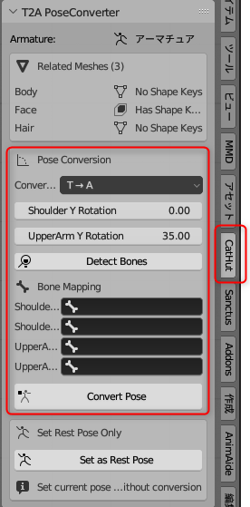

# T2A PoseConverter

## 概要
T2A PoseConverterはBlender用アドオンで、キャラクターモデルのT-poseとA-poseを相互に変換することができます。このアドオンはシェイプキーを持つモデルにも対応しています。

## 機能
- T-poseからA-poseへの変換
- A-poseからT-poseへの変換
- シェイプキーを持つメッシュの適切な処理
- 現在のポーズをレストポーズとして設定

## 要件
- Blender 3.6以上

## インストール方法
1. Blenderのメニューから「編集」→「プリファレンス」を選択
2. 「アドオン」タブを選択し、「インストール」ボタンをクリック
3. ダウンロードしたZIPファイル（`t2a_pose_converter-v*.*.*.zip`）を選択
4. 「T2A PoseConverter」アドオンを有効化（チェックボックスをオン）

## 使い方

### 基本的な使い方
1. 3Dビュー、またはビューレイヤーで変換したいアーマチュアオブジェクトを選択
2. サイドパネル（Nキー）を開き、「CatHut」タブを選択
3. 「T2A PoseConverter」パネルで変換設定を行う

### 使用手順（腕の角度を自動で調整する場合）

1. **変換モードの設定**：
   - 「T → A」：T-poseからA-poseへ変換
   - 「A → T」：A-poseからT-poseへ変換※角度の適応方向が違うだけです

2. **回転角度の設定**：
   - 「Shoulder Y Rotation」：肩ボーンのY軸回転角度（デフォルト：0度）
   - 「UpperArm Y Rotation」：上腕ボーンのY軸回転角度（デフォルト：30度）

3. **ボーンの検出と設定**：
   - 「Detect Bones」ボタンをクリックして肩と上腕のボーンを自動検出
   - または手動でボーン名を指定（ドロップダウンから選択可能）

4. **変換の実行**：
   - 「Convert Pose」ボタンをクリックして変換を実行

### 使用手順(腕の角度を自身で厳密に調整する場合)

1. **レストポーズの調整**：
   - ポーズモードでレストポーズにしたいポーズに調整してください
2. **レストポーズの設定**：
   - 「Set as Rest Pose」ボタンを押すと現在のポーズがレストポーズとして設定されます

### 自動ボーン検出について
アドオンは以下のような一般的な命名規則に基づいてボーンを自動検出します：
- 左肩：`shoulder_l`, `leftshoulder`, `肩_l`, `shoulder.l`, `l_shoulder`, `shoulderl`, `clavicle_l`, `clavicle.l`, `肩.l`, `肩l`, `左肩` など
- 右肩：`shoulder_r`, `rightshoulder`, `肩_r`, `shoulder.r`, `r_shoulder`, `shoulderr`, `clavicle_r`, `clavicle.r`, `肩.r`, `肩r`, `右肩` など
- 左上腕：`upperarm_l`, `leftupperarm`, `上腕_l`, `upperarm.l`, `l_upperarm`, `uppearml`, `arm_l`, `arm.l`, `腕_l`, `腕.l`, `腕l`, `左腕`, `左上腕` など
- 右上腕：`upperarm_r`, `rightupperarm`, `上腕_r`, `upperarm.r`, `r_upperarm`, `upperarmr`, `arm_r`, `arm.r`, `腕_r`, `腕.r`, `腕r`, `右腕`, `右上腕` など

ボーンが意図通りでない場合は手動で設定してください

## シェイプキー処理について
このアドオンは特にシェイプキーを持つメッシュの処理に対応しています：
1. 変換前のメッシュの状態をシェイプキーとして保存
2. ボーンの回転とレストポーズの適用を実行
3. すべてのシェイプキーを新しいレストポーズに合わせて再構築

これにより、ポーズ変換後もシェイプキーの効果が正しく保持されます。

## 注意事項
- 変換前にモデルのバックアップを取ることをお勧めします
- 多くのシェイプキーを持つメッシュでは処理に時間がかかる場合があります
- 変換後にモデルが正しく機能しているか念の為確認をお願いします
- ポーズの変更とシェイプキーが干渉する場合、意図通りの変換にならない場合があります

## トラブルシューティング
- ボーンが検出されない場合は、手動でボーン名を指定してください

## ライセンス
MIT License

## 作者
CatHut
