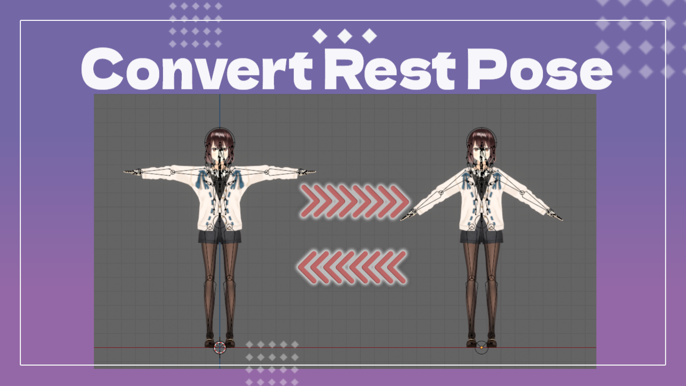
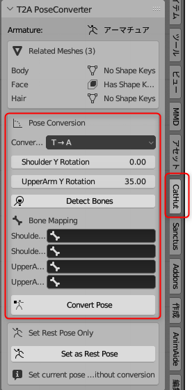
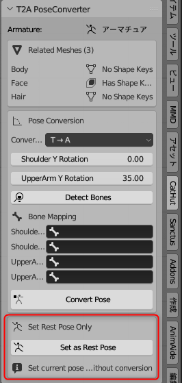

# T2A PoseConverter

## Overview
T2A PoseConverter is a Blender addon that allows you to convert character models between T-pose and A-pose. This addon also supports models with shape keys.

## Features
- Convert from T-pose to A-pose
- Convert from A-pose to T-pose
- Proper handling of meshes with shape keys
- Set current pose as rest pose

## Requirements
- Blender 3.6 or higher

## Installation
1. From Blender's menu, select "Edit" → "Preferences"
2. Select the "Add-ons" tab and click the "Install" button
3. Select the downloaded ZIP file (`t2a_pose_converter-v*.*.*.zip`)
4. Enable the "T2A PoseConverter" addon (check the checkbox)

## Usage

### Basic Usage
1. Select the armature object you want to convert in the 3D View or View Layer
2. Open the side panel (N key) and select the "CatHut" tab
3. Configure conversion settings in the "T2A PoseConverter" panel

### Instructions (for automatic arm angle adjustment)

1. **Set Conversion Mode**:
   - "T → A": Convert from T-pose to A-pose
   - "A → T": Convert from A-pose to T-pose *Note: This only changes the direction of angle application

2. **Set Rotation Angles**:
   - "Shoulder Y Rotation": Y-axis rotation angle for shoulder bones (default: 0 degrees)
   - "UpperArm Y Rotation": Y-axis rotation angle for upper arm bones (default: 30 degrees)

3. **Detect and Set Bones**:
   - Click the "Detect Bones" button to automatically detect shoulder and upper arm bones
   - Or manually specify bone names (selectable from dropdown)

4. **Execute Conversion**:
   - Click the "Convert Pose" button to execute the conversion

### Instructions (for precise manual arm angle adjustment)

1. **Adjust Rest Pose**:
   - In Pose mode, adjust to the pose you want as the rest pose
2. **Set Rest Pose**:
   - Press the "Set as Rest Pose" button to set the current pose as the rest pose

### About Automatic Bone Detection
The addon automatically detects bones based on common naming conventions such as:
- Left Shoulder: `shoulder_l`, `leftshoulder`, `肩_l`, `shoulder.l`, `l_shoulder`, `shoulderl`, `clavicle_l`, `clavicle.l`, `肩.l`, `肩l`, `左肩`, etc.
- Right Shoulder: `shoulder_r`, `rightshoulder`, `肩_r`, `shoulder.r`, `r_shoulder`, `shoulderr`, `clavicle_r`, `clavicle.r`, `肩.r`, `肩r`, `右肩`, etc.
- Left Upper Arm: `upperarm_l`, `leftupperarm`, `上腕_l`, `upperarm.l`, `l_upperarm`, `uppearml`, `arm_l`, `arm.l`, `腕_l`, `腕.l`, `腕l`, `左腕`, `左上腕`, etc.
- Right Upper Arm: `upperarm_r`, `rightupperarm`, `上腕_r`, `upperarm.r`, `r_upperarm`, `upperarmr`, `arm_r`, `arm.r`, `腕_r`, `腕.r`, `腕r`, `右腕`, `右上腕`, etc.

If bones are not detected as intended, please set them manually.

## About Shape Key Processing
This addon specifically supports processing meshes with shape keys:
1. Saves the pre-conversion mesh state as a shape key
2. Executes bone rotation and rest pose application
3. Rebuilds all shape keys to match the new rest pose

This ensures that shape key effects are properly maintained after pose conversion.

## Notes
- It is recommended to backup your model before conversion
- Processing may take time for meshes with many shape keys
- Please verify that the model functions correctly after conversion
- If pose changes interfere with shape keys, the conversion may not work as intended

## Troubleshooting
- If bones are not detected, please specify bone names manually

## License
MIT License

## Author
CatHut